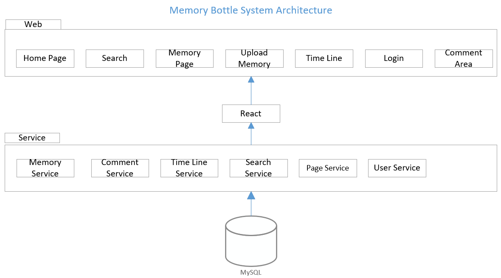
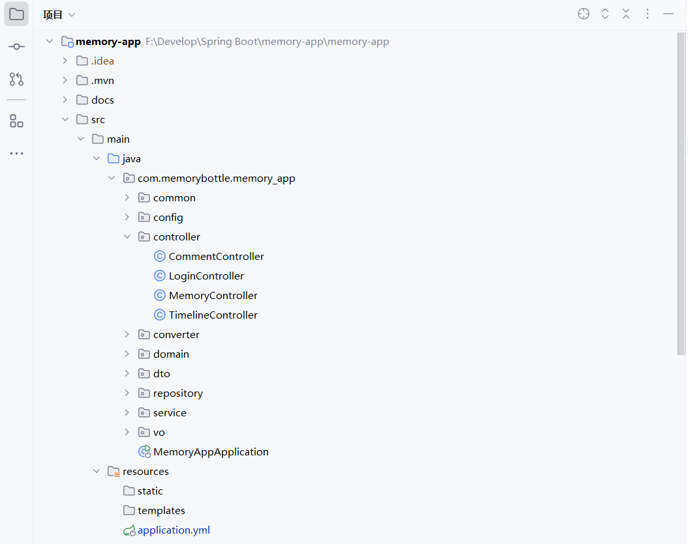
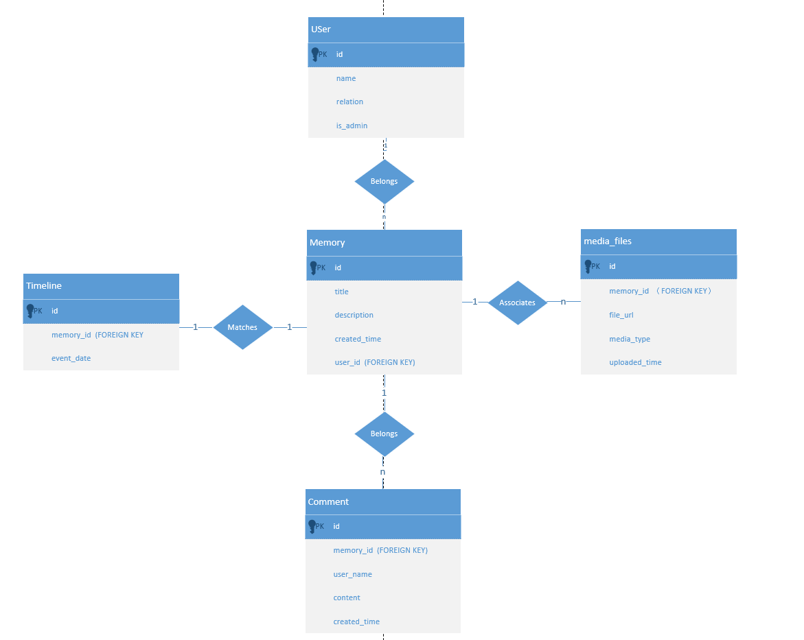
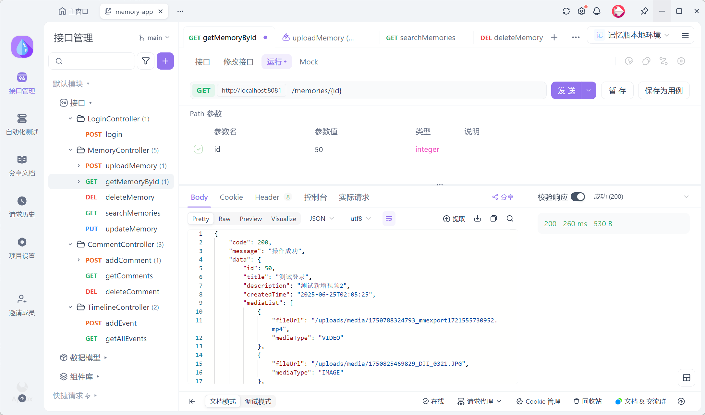
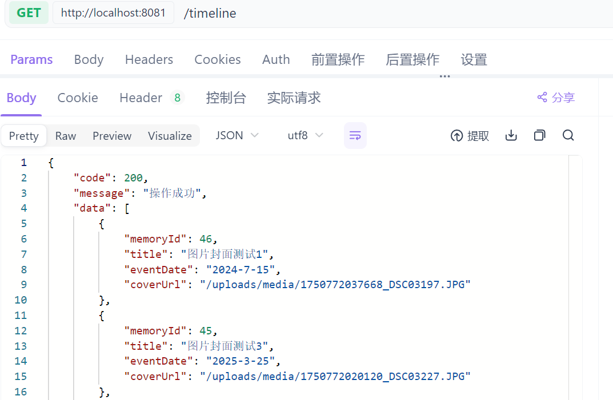
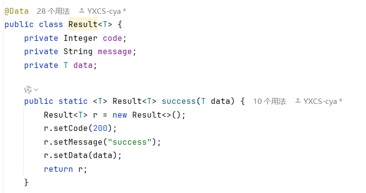

# 🧠 Memory Bottle (Backend)

> Spring Boot backend for "Memory Bottle": a memory archiving web service for families affected by memory loss and Alzheimer's. Supports timeline, media upload, and comment interaction.


---

## 🎯 Project Background
Memory Bottle is a web-based system designed to preserve and revisit family memories —  
supporting emotional connection and cognitive well-being among older adults.  
While the frontend focuses on interactive storytelling and emotional design,  
this backend project centers on **system architecture, data persistence, and secure media management**.

For a detailed overview of the user experience and UI design,please refer to the:
> 🪶 *Frontend Repository:* [Memory Bottle (Frontend)](https://github.com/YXCS-cya/memory-bottle-frontend)

---

## 🌟 Overview

**Memory Bottle** is a full-stack web project designed to preserve personal memories in a structured and interactive way.  
The backend provides a RESTful service built with **Spring Boot** and **MySQL**, offering endpoints for memory creation, timeline generation, media upload, and comment management.  
It follows a **layered architecture** with clear separation between controller, service, and repository layers.

The frontend client (React + Vite) interacts with this backend through REST APIs.


---

## 🧩 Features

- 📝 Create, update, and delete memory entries  
- 🖼 Upload and manage images/videos for each memory  
- 📅 Display memories on a timeline with cover previews  
- 💬 Comment system for user interaction  
- 🔐 Header-based user identity & permission control  
- 📂 RESTful API design, tested via **Apifox**

---

## 🧰 Tech Stack

| Layer | Technologies |
|-------|---------------|
| Backend Framework | Spring Boot 3.x |
| Language | Java 17 |
| Database | MySQL |
| ORM | Spring Data JPA |
| File Handling | Multipart upload + local storage |
| Architecture | RESTful + Layered (Controller / Service / Repository) |
| Testing | Apifox / Postman |

---

## 🗂️ Media Storage & Access
- Uploaded photos and videos are stored on the server under the Spring Boot `resources/static` directory,  
  which is automatically exposed as a public resource path.
- Each uploaded file is assigned a generated filename, and only its URL (e.g. `/media/<generated-name>.jpg`)  
  is saved in the database instead of the binary content.
- During upload, the backend concatenates the file path dynamically and returns the generated URL to the frontend,  
  which renders it directly in the memory timeline or detail view.

---

## 🧠 System Architecture



The system consists of three core layers:

1. **Frontend (React SPA)** — handles user interface and API requests.  
2. **Backend (Spring Boot)** — processes business logic, file storage, and permission validation.  
3. **Database (MySQL)** — stores memories, comments, media metadata, and timeline events.

---

## 📁 Project Structure



**Directory Layout**
```
memory-bottle/
├─ controller/ # REST controllers (Memory, Comment, Timeline)
├─ service/ # Business logic
├─ repository/ # Data access layer
├─ domain/ # Entity definitions (Memory, Comment, Media)
├─ dto/ & vo/ # Data transfer and view objects
└─ config/ # Global configuration
```


---

## 🗄️ Database Design



The database includes five primary entities:
- **User** – stores user info and admin flag  
- **Memory** – core table for text and metadata  
- **Media_Files** – stores file URLs and media type  
- **Comment** – user comments linked to a memory  
- **Timeline** – maps events chronologically

---

## ⚙️ API Verification



All core endpoints have been tested using **Apifox**, including:
- `/memories/upload`
- `/memories`
- `/comments`
- `/timeline`

---

## 📆 Timeline API Example



The timeline endpoint returns simplified event objects:
```json
{
  "code": 200,
  "message": "Success",
  "data": [
    {
      "memoryId": 46,
      "title": "Sample Event",
      "eventDate": "2024-07-15",
      "coverUrl": "/uploads/media/sample_image.jpg"
    }
  ]
}
```

## 🔁 Unified Response Format

All endpoints return a unified structure via the generic `Result<T>` class:


## 🧱 Service Mapping

Each module corresponds to its own service layer:

- MemoryController → MemoryService
- TimelineController → TimelineService
- CommentController → CommentService
- LoginController → LoginService

## 🧾 API Reference

Full backend API specification can be found in:

 [📄MemoryBottle_API_Documentation](docs/MemoryBottle_API_Documentation.md)

 ## 🚀 How to Run
1. Clone the repository
```
git clone https://github.com/YXCS-cya/memory-bottle.git
cd memory-bottle
```
2. Configure database in application.yml
```
spring:
  datasource:
    url: jdbc:mysql://localhost:3306/memory_bottle
    username: root
    password: your_password
```
3. Run with Maven
```
mvn spring-boot:run
```
4. Access API
- Default port: 8081
- Base path: /memories, /comments, /timeline

## 🔒 Permission Control

- User identity injected via X-User-Id header
- Permission validated with checkPermission(userId, ownerId)
- Restricted endpoints: update, delete, comment delete

## 🧩 Future Work
- Integrate cloud-based media storage
- Add authentication & user roles (JWT)
- Deploy full-stack version online with React frontend
---
## 🛠 Build & Run Note

This project can be compiled and executed directly from source using IntelliJ IDEA or any Java IDE.
No external libraries are required. The server should be launched before running the client.
Detailed setup instructions are provided above in "🚀 How to Run".


> Designed and implemented independently as a full backend for the Memory Bottle system.
